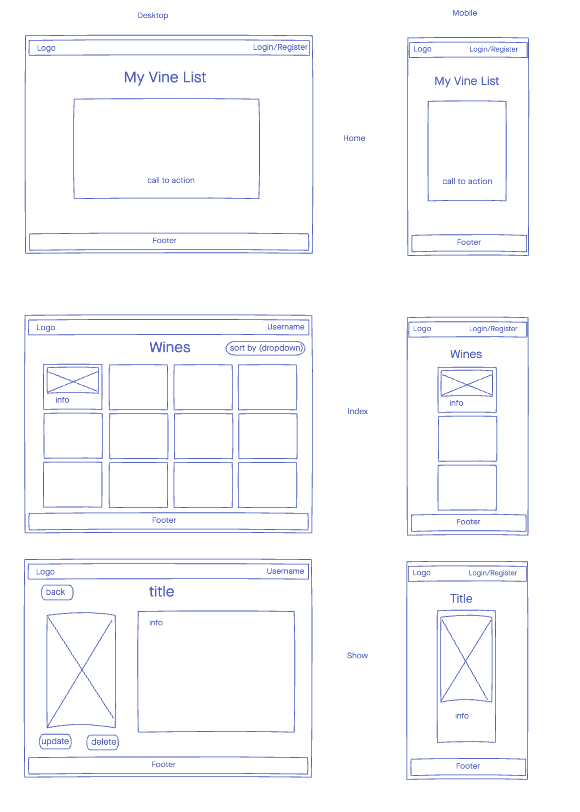
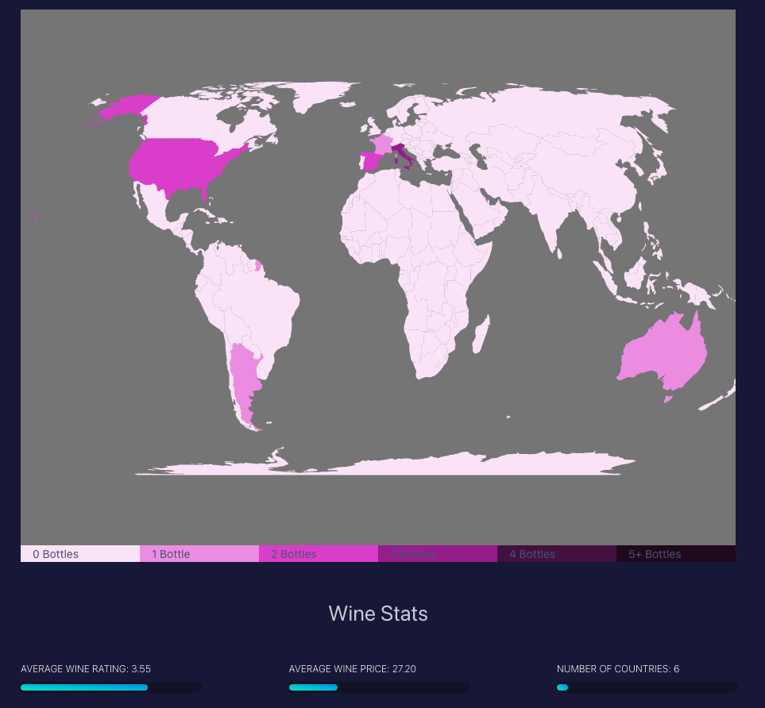
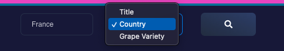

 

  <h2 align="center">My Vine List (Frontend)</h2>
 
 

<!-- TABLE OF CONTENTS -->

  
Table of Contents

  <ol>
    <li>
      <a href="#about-the-project">About The Project</a>
      <ul>
        <li><a href="#built-with">Technologies Used</a></li>
      </ul>
    </li>
    <li>
      <a href="#Wireframe">Wireframe</a>
    </li>
     <li><a href="#future-enhancements">Future Enhancements</a></li>

  </ol>

<!-- ABOUT THE PROJECT -->

# **About The Project**

My vine list is built in React and connects to a Django backend serving JSON API. The app facilitates login/register/logout features using the context API for global state and checks for tokens provided by the backend in local storage. Users can access there wine list and perform full CRUD on their entries as well as search there list by title, country and grape variety.

 Users can also veiw there consupmtion information in more details on the stats page. The stats page incorporates a world map SVG to track where the bottles that the user purchased are from and provides average rating and price details.

The live version of this app can be viewed [here.](https://cocky-aryabhata-964b73.netlify.app/)

The backend GitHub can be found [here.](https://github.com/Joshua-Zalcman/my-vine-list-backend)

# **Built With**

- [REACT](https://reactjs.org/docs/getting-started.html)
- [React-Router-Dom](https://reactrouter.com/web/guides/quick-start)
- [Creative-Tim](https://www.creative-tim.com/)
- [Reactstrap](https://reactstrap.github.io/)
- [React-simple-maps](https://www.react-simple-maps.io/)

# **Wireframe**

# **Images**

Index Page

Stats Page

Search Bar

# **Future Enhancements**

- Complete profile and setting pages for User model CRUD operations
- Ability to upload image files
- Styling improvements
- Add additional stats to stats page: Dates, Regions, etc...
- More map features
- More mobile responsiveness
